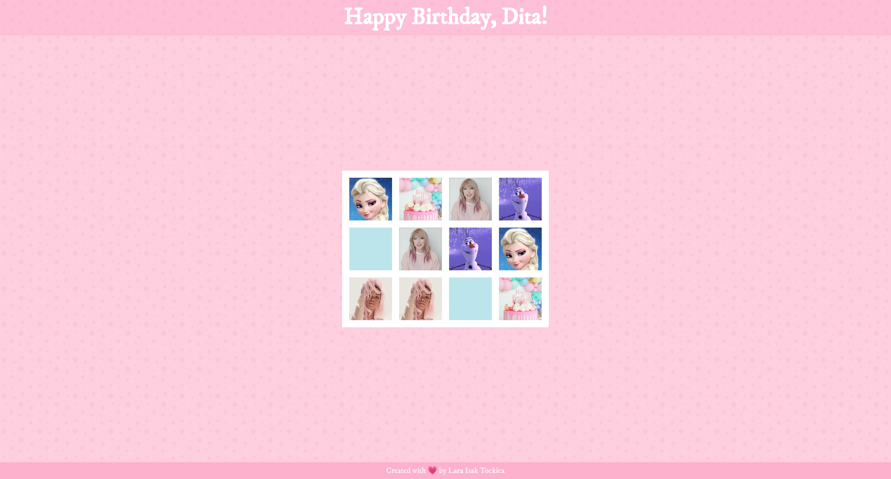

# pink-pairs

Pink Pairs is a memory card game created with **HTML, CSS & JavaScript** as a birthday gift for the coolest little friend, Dita. :heartpulse:

The game design is inspired by Dita's favorite color (**pink**), favorite cartoon (**Frozen**) and 2 of her favorite musicians (**Taylor and RiRi**).

You can find and play the game [here](https://lara-isak.github.io/pink-pairs/).

### :flower_playing_cards: Game rules
- Start by flipping over one card
- If the next card you flip matches, an audio clip, matching the character on the cards, starts playing and cards remain visible
- If the next card you flip does not match, the cards flip back
- The game is done when all the cards are matched (and when you see confetti on the screen) :tada:

### :thumbsup: Motivation behind the project
Better understanding of **targeting specific nodes (and their children)** and **manipulating** them using DOM

### :seedling: What I learned
:arrow_right: how and when to use **innerHTML()** and **insertAdjacentHTML()** methods  
:arrow_right: how to use **target Event property** to "grab" the element which triggered the event  
:arrow_right: how to utilize **setTimeout() method** to call a function after a specified number of miliseconds  
:arrow_right: how to make use of **setAttribute() / removeAttribute() methods** to set a value of an attribute / remove the attribute completely, on the specified element  
:arrow_right: how to utilize **audio HTML element** and its **attributes** (e.g. **autoplay**) and **events** (e.g. **pause**) to embed sound content and manipulate it
